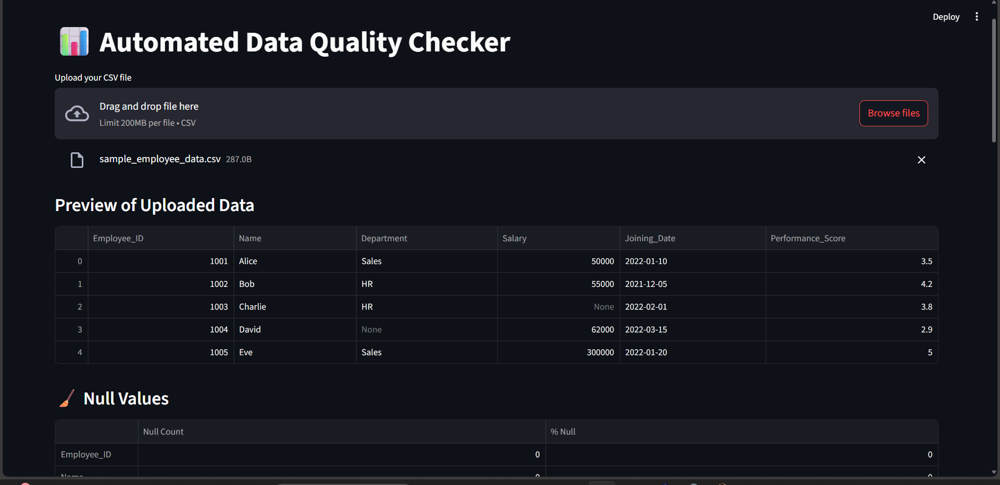
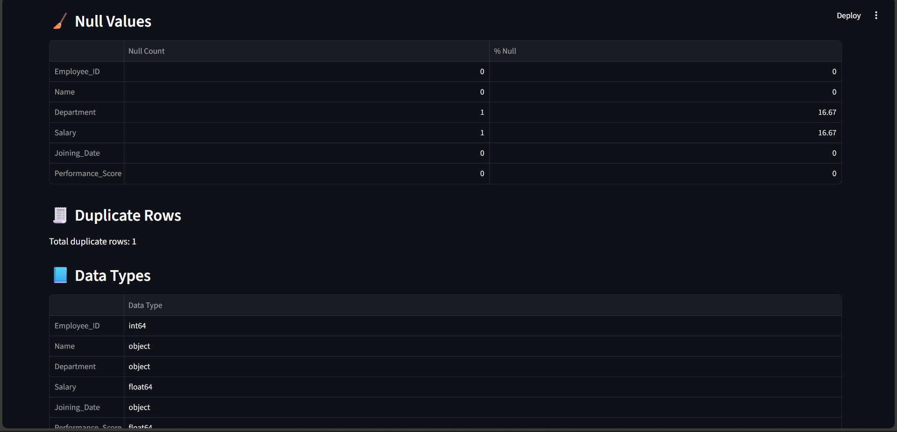
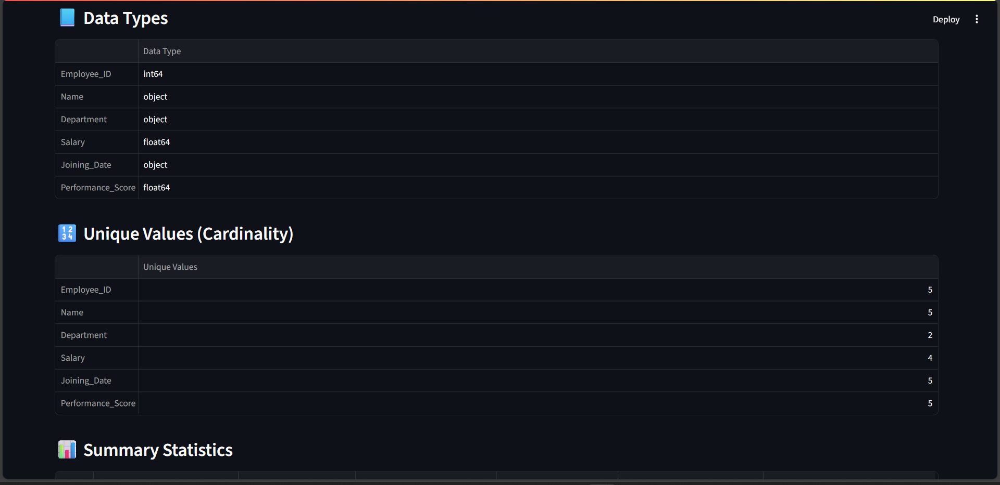
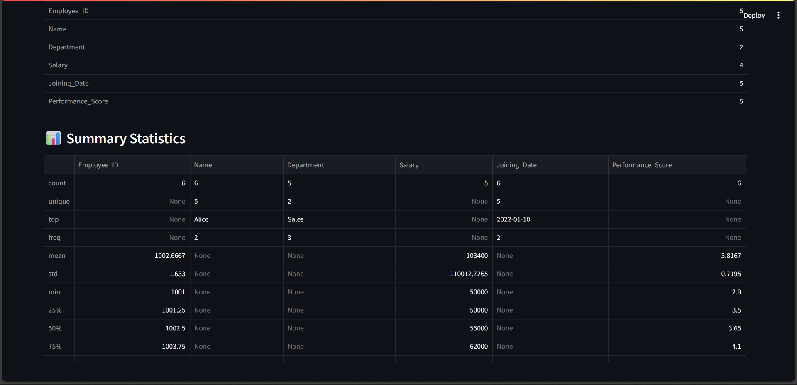
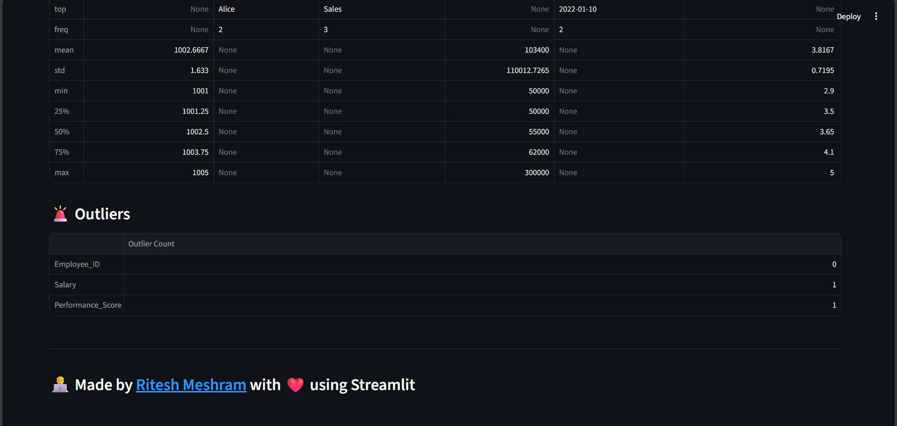

🧪 Automated Data Quality Checker
This is a lightweight Streamlit web app that performs automatic data quality checks on uploaded CSV files. It’s built to help users — technical or not — quickly assess the cleanliness and reliability of their data before further processing.

🚀 Features
Upload any .csv dataset

Instant analysis of:

Missing values

Duplicated rows

Data types per column

Unique value counts

Outlier detection (using IQR method)

Summary statistics (mean, median, std, etc.)

📂 How to Run Locally
1. Clone or Download
Unzip or clone the project:

bash
Copy
Edit
git clone 
cd Data--Quality--Checker
2. Install Requirements
bash
Copy
Edit
pip install -r requirements.txt
3. Run the App
bash
Copy
Edit
streamlit run app.py

📊 Sample Dataset
Use the included sample_employee_data.csv to test features like:

Null values in "Salary" and "Department"

Duplicate employee entries

Data Types and Unique Values

📊 Summary Statistics
Quick overview of each numeric column including mean, median, min, max, and standard deviation:

Outlier salary (₹300,000)

🧠 Technologies Used
Streamlit – UI framework

Pandas – Data analysis

NumPy – Numeric operations

🎯 Use Cases
Quick data sanity checks before loading to a data warehouse

Data validation for analysts or business users

Reusable for HR, finance, sales, or any function working with data

📌 Future Enhancements
GPT-powered summary of data issues

Downloadable PDF reports

Slack/email integration for alerts

🛡️ Notes
No internal or sensitive data is used

Works completely offline with local files

### 👨‍💻 Made by [Ritesh Meshram](https://in.linkedin.com/in/ritesh-meshram)
